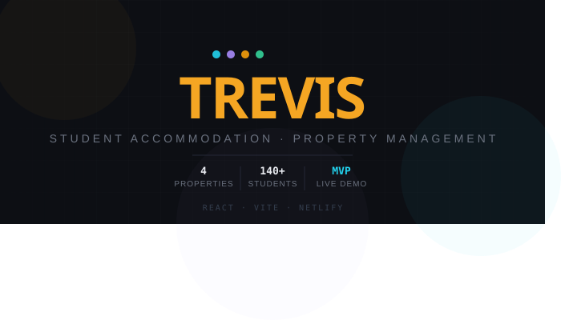

<div align="center">
  

  <h1>Trevis Property Manager</h1>
  <p><strong>A modern, high-performance property management portal for student accommodation.</strong></p>

  <p>
    <a href="#features">Features</a> • 
    <a href="#architecture">Architecture</a> • 
    <a href="#installation">Installation</a> • 
    <a href="#built-with">Built With</a>
  </p>
</div>

---

## 🏢 Overview

Trevis (formerly PropNest) is an MVP property management web application tailored for multi-property student accommodation operations. It tracks occupancy, records rent collections, alerts on arrears, and generates dynamic financial reports. 

Currently, the MVP operates purely in-memory using seed data extracted from a real-world February 2026 rent roll, allowing rapid demonstration of UI/UX flows and feature sets without a heavy backend.

## ✨ Features

### 📊 Dynamic Dashboard
* High-level KPI strips (Total Students, Collected Rent, Outstanding Rent, Collection Rate).
* Visual collection bar charts comparing expected vs. collected revenue across properties.
* A sortable "Attention Required" table tracking tenants with overdue or partial payments.

### 🛡️ Role-Based Authentication
* **Admin**: Full access. Can add students, record payments, and view all system functions.
* **Manager**: View-only access with restricted mutation permissions.

### 👥 Tenant & Occupancy Management
* **Add Student Wizard**: A 4-step modal workflow that automatically detects available (vacant) beds and assigns tenants to correct properties and rooms.
* Real-time tracking of Vacant vs. Occupied beds.

### 💳 Payment Processing
* **Record Payment Modal**: Allows managers to log installments, specify payment methods (Cash, Transfer, Swipe), and attach receipt references.
* Maintains a transaction history log per student.

### 📈 Advanced Reporting
* **Income Summary**: Track aggregated expected rent, collected funds, arrears, and collection percentage by property.
* **Outstanding Balances**: Granular view of individual tenant arrears.
* **Occupancy Report**: Overview of utilized and vacant capacity.
* **1-Click CSV Export**: Easily download snapshot reports to your local machine.

### 📱 Responsive Design
* Hand-crafted CSS using modern CSS media queries and flexbox/grid architectures.
* Dark-slate aesthetic enhanced with custom `IBM Plex Mono` numerical styling.
* Fully mobile-optimized with a slide-out hamburger navigation and scalable card grids.

## 🛠️ Architecture

The React Vite app uses a **modular compilation system** (`build_app.cjs`). To keep the scope simple while retaining single-file deployment logic, core functionalities are split across multiple modular logical parts:
* `p1_imports_seed.js`: Seed JSON object holding property structures (King Fisher, The Chase, Madden, Prices), plus initial student states.
* `p2_helpers.js`: Shared components, charts, layout CSS, design tokens, and utilities.
* `p3_modals.js`: Auth screen and modal workflows (Payment & Add Student).
* `p4_dashboard.js`: The central overview analytics view.
* `p5_views.js`: Individual detail drill-downs and generic student listings.
* `p6_reports_shell.js`: Financial/Occupancy tabs and the global App shell + router.

These parts are compiled dynamically into `src/App.jsx` during development using the build script.

## 🚀 Installation

Ensure you have [Node.js](https://nodejs.org/) installed on your machine.

1. **Clone the repository:**
   ```bash
   git clone https://github.com/98Devops/trevis-app.git
   cd trevis-app
   ```

2. **Install dependencies:**
   ```bash
   npm install
   ```

3. **Rebuild the architectural core (Optional):**
   ```bash
   node build_app.cjs
   ```

4. **Launch development server:**
   ```bash
   npm run dev
   ```

5. **Access the Application:**
   Open `http://localhost:5174/` in your browser. 
   
   **Demo Credentials:**
   * Admin: `admin@trevis.co.zw` / `admin1234`
   * Manager: `manager@trevis.co.zw` / `manager1234`

## 💻 Built With

* **[React](https://reactjs.org/)** - UI Framework (Hooks & State management)
* **[Vite](https://vitejs.dev/)** - Next Generation Frontend Tooling
* **Vanilla CSS** - Zero-dependency responsive design and animations
* **No Backend (MVP)** - Utilizes pure JavaScript in-memory state manipulation
