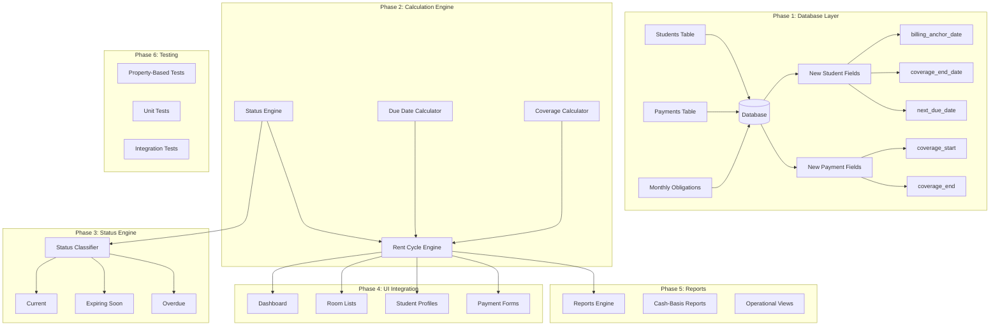

# Design Document: Flexible Rent Cycle Engine

## Overview

The Flexible Rent Cycle Engine represents a fundamental shift from calendar-month billing to student-individualized billing cycles in the Trevis property management system. This design implements a comprehensive billing transformation while maintaining production safety through additive migrations and parallel operation capabilities.

### Core Innovation

Instead of assuming all students follow a calendar-month billing schedule (1st to 30th/31st), each student maintains their own billing cycle anchored to their payment date. A student paying on June 19th receives coverage from June 19th through July 18th, becoming overdue on July 19th, not July 1st.

### Critical Business Rules (System of Record)

**These rules MUST be enforced at all layers - database, services, and UI:**

1. **Coverage_End_Date is the Primary Billing Truth**
   - All operational decisions derive from coverage_end
   - Status calculations use coverage_end, NOT calendar months
   - Dashboard metrics calculate from coverage_end
   - Arrears bucketing uses coverage_end

2. **Early Payments Extend Existing Coverage**
   - When payment_date < coverage_end_date, new coverage starts on (coverage_end + 1)
   - Prepaid days can NEVER be lost or overwritten
   - Coverage always moves forward, never resets backward

3. **Prepaid Days Are Sacred**
   - The system SHALL preserve 100% of prepaid coverage
   - Payment processing SHALL validate prepaid day preservation
   - Coverage extension SHALL be additive only

4. **Occupancy State Filtering**
   - Only ACTIVE students appear in operational metrics
   - CHECKED_OUT students excluded from status calculations
   - Dashboard counts filter by status = 'ACTIVE'
   - Arrears view shows only ACTIVE students

5. **Dashboard Derives from Coverage Dates**
   - Current count: students with coverage_end > today + 7 days
   - Expiring Soon count: students with coverage_end between today and today + 7 days
   - Overdue count: students with coverage_end < today
   - NO calendar month assumptions

### System Benefits

- **Accurate Coverage Tracking**: Precise calculation of coverage periods based on actual payment amounts and dates
- **Individual Billing Cycles**: Each student maintains their own billing anchor date and due dates
- **Flexible Payment Handling**: Support for partial payments, overpayments, and variable payment amounts
- **Enhanced Status Management**: Real-time status classification (Current, Expiring Soon, Overdue) based on actual coverage
- **Production Safety**: Zero-downtime deployment through additive migrations and parallel system operation
- **Prepaid Coverage Protection**: Early payments extend coverage without losing prepaid days

## Architecture

### High-Level System Architecture



### 6-Phase Implementation Strategy

The implementation follows a phased approach ensuring production safety:

1. **Phase 1**: Additive database schema changes only
2. **Phase 2**: Coverage calculation engine implementation
3. **Phase 3**: Student status classification engine
4. **Phase 4**: Dashboard and UI integration
5. **Phase 5**: Report system updates
6. **Phase 6**: Comprehensive testing framework

## Components and Interfaces

### Phase 1: Database Schema Extensions

#### New Student Table Fields

```sql
-- Additive-only migration for students table
ALTER TABLE students ADD COLUMN billing_anchor_date date;
ALTER TABLE students ADD COLUMN coverage_end_date date;
ALTER TABLE students ADD COLUMN next_due_date date;
ALTER TABLE students ADD COLUMN daily_rate numeric(8,2);
```

#### New Payment Table Fields

```sql
-- Additive-only migration for payments table  
ALTER TABLE payments ADD COLUMN coverage_start date;
ALTER TABLE payments ADD COLUMN coverage_end date;
ALTER TABLE payments ADD COLUMN coverage_days integer;
```

#### Migration Safety Rules

- **Additive Only**: No columns dropped, renamed, or modified
- **Nullable Fields**: All new fields allow NULL during migration
- **Parallel Operation**: Existing monthly billing continues during transition
- **Rollback Capable**: Full restoration possible without data loss

### Phase 2: Coverage Calculation Engine

#### RentCycleCalculator Class

```javascript
class RentCycleCalculator {
  /**
   * Calculate payment coverage based on amount and daily rate
   * @param {number} amount - Payment amount
   * @param {number} monthlyRent - Monthly rent amount
   * @returns {Object} Coverage calculation result
   */
  calculateCoverage(amount, monthlyRent) {
    const dailyRate = monthlyRent / 30;
    const coverageDays = Math.round(amount / dailyRate);
    
    return {
      dailyRate,
      coverageDays,
      isFullMonth: Math.abs(coverageDays - 30) <= 1,
      isPartial: coverageDays < 30,
      isOverpayment: coverageDays > 30
    };
  }

  /**
   * Calculate coverage dates from payment
   * @param {Date} paymentDate - Date of payment
   * @param {number} coverageDays - Days of coverage
   * @returns {Object} Coverage period
   */
  calculateCoveragePeriod(paymentDate, coverageDays) {
    const coverageStart = new Date(paymentDate);
    const coverageEnd = new Date(paymentDate);
    coverageEnd.setDate(coverageEnd.getDate() + coverageDays - 1);
    
    return {
      coverageStart,
      coverageEnd,
      coverageDays
    };
  }

  /**
   * Calculate next due date based on billing anchor
   * @param {Date} coverageEnd - End of current coverage
   * @param {number} billingAnchorDay - Day of month for billing
   * @returns {Date} Next due date
   */
  calculateNextDueDate(coverageEnd, billingAnchorDay) {
    const nextMonth = new Date(coverageEnd);
    nextMonth.setDate(billingAnchorDay);
    
    if (nextMonth <= coverageEnd) {
      nextMonth.setMonth(nextMonth.getMonth() + 1);
    }
    
    return nextMonth;
  }
}
```

#### PaymentProcessor Class

```javascript
class PaymentProcessor {
  constructor(calculator) {
    this.calculator = calculator;
  }

  /**
   * Process payment and update student billing cycle
   * CRITICAL RULES:
   * 1. Coverage_End_Date is the primary billing truth (system of record)
   * 2. Early payments extend from existing coverage_end_date, never discard prepaid days
   * 3. Only process ACTIVE students
   * 
   * @param {Object} payment - Payment record
   * @param {Object} student - Student record with room info
   * @returns {Object} Updated billing information
   */
  async processPayment(payment, student) {
    const { amount, payment_date } = payment;
    const { rent_per_bed, coverage_end } = student;
    
    // Calculate coverage days for this payment
    const coverage = this.calculator.calculateCoverage(amount, rent_per_bed);
    
    // CRITICAL: Determine coverage start date
    // If student has existing coverage and payment is before coverage_end (early payment),
    // start new coverage AFTER existing coverage ends to preserve prepaid days
    const paymentDate = new Date(payment_date);
    const existingCoverageEnd = coverage_end ? new Date(coverage_end) : null;
    
    let coverageStartDate;
    let isEarlyPayment = false;
    
    if (existingCoverageEnd && paymentDate <= existingCoverageEnd) {
      // Early payment: extend from existing coverage end
      coverageStartDate = new Date(existingCoverageEnd);
      coverageStartDate.setDate(coverageStartDate.getDate() + 1); // Start day after existing coverage ends
      isEarlyPayment = true;
    } else {
      // Normal payment: coverage starts from payment date
      coverageStartDate = paymentDate;
    }
    
    // Calculate coverage end date from the determined start date
    const coverageEndDate = new Date(coverageStartDate);
    coverageEndDate.setDate(coverageEndDate.getDate() + coverage.coverageDays - 1);
    
    // Update billing anchor on first payment or when not an early payment
    const billingAnchorDay = isEarlyPayment && student.billing_anchor_date
      ? new Date(student.billing_anchor_date).getDate()
      : paymentDate.getDate();
    
    // Calculate next due date
    const nextDueDate = this.calculator.calculateNextDueDate(
      coverageEndDate, 
      billingAnchorDay
    );
    
    return {
      billingAnchorDate: isEarlyPayment && student.billing_anchor_date 
        ? new Date(student.billing_anchor_date)
        : paymentDate,
      coverageStart: coverageStartDate,
      coverageEnd: coverageEndDate,
      nextDueDate: nextDueDate,
      dailyRate: coverage.dailyRate,
      coverageDays: coverage.coverageDays,
      isEarlyPayment,
      prepaidDaysPreserved: isEarlyPayment ? 
        Math.ceil((existingCoverageEnd - paymentDate) / (1000 * 60 * 60 * 24)) : 0
    };
  }
}
```

### Phase 3: Student Status Engine

#### StatusClassifier Class

```javascript
class StatusClassifier {
  /**
   * Classify student status based on coverage end date
   * CRITICAL RULES:
   * 1. Coverage_End_Date is the primary billing truth
   * 2. Only process ACTIVE students
   * 3. CHECKED_OUT students are excluded from all calculations
   * 
   * @param {Date} coverageEndDate - When coverage expires
   * @param {Date} currentDate - Current date (defaults to today)
   * @param {string} studentStatus - Student occupancy status
   * @returns {Object} Status classification
   */
  classifyStatus(coverageEndDate, currentDate = new Date(), studentStatus = 'ACTIVE') {
    // Exclude non-active students from status calculations
    if (studentStatus !== 'ACTIVE') {
      return { 
        status: 'EXCLUDED', 
        reason: `Student status is ${studentStatus}`,
        daysRemaining: null, 
        isOverdue: false,
        excludeFromMetrics: true
      };
    }
    
    if (!coverageEndDate) {
      return { 
        status: 'NO_COVERAGE', 
        daysRemaining: null, 
        isOverdue: true,
        excludeFromMetrics: false
      };
    }
    
    const timeDiff = coverageEndDate.getTime() - currentDate.getTime();
    const daysRemaining = Math.ceil(timeDiff / (1000 * 60 * 60 * 24));
    
    if (daysRemaining > 7) {
      return { 
        status: 'CURRENT', 
        daysRemaining, 
        isOverdue: false,
        displayText: `${daysRemaining} days remaining`,
        excludeFromMetrics: false
      };
    } else if (daysRemaining >= 1) {
      return { 
        status: 'EXPIRING_SOON', 
        daysRemaining, 
        isOverdue: false,
        displayText: `${daysRemaining} days remaining`,
        excludeFromMetrics: false
      };
    } else {
      const daysOverdue = Math.abs(daysRemaining);
      return { 
        status: 'OVERDUE', 
        daysOverdue, 
        isOverdue: true,
        displayText: daysOverdue === 0 ? 'Due today' : `${daysOverdue} days overdue`,
        excludeFromMetrics: false
      };
    }
  }

  /**
   * Get status counts for dashboard metrics
   * CRITICAL: Excludes CHECKED_OUT and non-ACTIVE students
   * 
   * @param {Array} students - Array of students with coverage data
   * @returns {Object} Status counts
   */
  getStatusCounts(students) {
    const counts = {
      current: 0,
      expiringSoon: 0,
      overdue: 0,
      noCoverage: 0,
      excluded: 0
    };

    students.forEach(student => {
      const status = this.classifyStatus(
        student.coverage_end ? new Date(student.coverage_end) : null,
        new Date(),
        student.status
      );
      
      // Skip excluded students (CHECKED_OUT, etc.)
      if (status.excludeFromMetrics) {
        counts.excluded++;
        return;
      }
      
      switch (status.status) {
        case 'CURRENT':
          counts.current++;
          break;
        case 'EXPIRING_SOON':
          counts.expiringSoon++;
          break;
        case 'OVERDUE':
          counts.overdue++;
          break;
        case 'NO_COVERAGE':
          counts.noCoverage++;
          break;
      }
    });

    return counts;
  }
}
```

### Phase 4: Dashboard Integration

#### Enhanced Student Service

```javascript
// Enhanced studentService.js
export class StudentServiceEnhanced {
  constructor(statusClassifier) {
    this.statusClassifier = statusClassifier;
  }

  /**
   * Get students with enhanced status information
   * CRITICAL RULES:
   * 1. Only fetch ACTIVE students for operational metrics
   * 2. CHECKED_OUT students excluded from status calculations
   * 3. Coverage_End_Date is the billing truth
   * 
   * @param {string} propertyId - Property identifier
   * @returns {Array} Students with status classifications
   */
  async getStudentsWithStatus(propertyId) {
    const { data: students, error } = await supabase
      .from('students')
      .select(`
        *, 
        rooms!inner(
          id, room_number, bed_capacity, rent_per_bed, property_id, 
          properties(id, name)
        )
      `)
      .eq('rooms.property_id', propertyId)
      .eq('status', 'ACTIVE'); // Only ACTIVE students

    if (error) return { data: [], error };

    // Enhance with status classification
    const enhancedStudents = students.map(student => {
      const statusInfo = this.statusClassifier.classifyStatus(
        student.coverage_end ? new Date(student.coverage_end) : null,
        new Date(),
        student.status
      );
      
      return {
        ...student,
        statusInfo,
        coveragePeriod: this.formatCoveragePeriod(student),
        dailyRateFormatted: student.daily_rate ? 
          `$${student.daily_rate.toFixed(2)}/day` : null
      };
    });

    return { data: enhancedStudents, error: null };
  }

  /**
   * Format coverage period for display
   * @param {Object} student - Student record
   * @returns {string} Formatted coverage period
   */
  formatCoveragePeriod(student) {
    if (!student.billing_anchor_date || !student.coverage_end) {
      return 'No active coverage';
    }

    const start = new Date(student.billing_anchor_date).toLocaleDateString();
    const end = new Date(student.coverage_end).toLocaleDateString();
    return `${start} - ${end}`;
  }
}
```

#### Dashboard KPI Updates

```javascript
// Enhanced Dashboard component integration
export function EnhancedDashboard({ propertyData, statusCounts }) {
  return (
    <div className="dashboard-container">
      {/* Updated KPI Strip */}
      <div className="kpi-grid">
        <Stat 
          label="Current" 
          value={statusCounts.current} 
          accent={T.green}
          subtitle="7+ days remaining"
        />
        <Stat 
          label="Expiring Soon" 
          value={statusCounts.expiringSoon} 
          accent={T.amber}
          subtitle="1-7 days remaining"
        />
        <Stat 
          label="Overdue" 
          value={statusCounts.overdue} 
          accent={T.red}
          subtitle="Coverage expired"
        />
        <Stat 
          label="Collection Rate" 
          value={calculateCollectionRate(propertyData)}
          accent={T.blue}
        />
      </div>
      
      {/* Rest of dashboard components */}
    </div>
  );
}
```

### Phase 5: Payment Integration

#### PaymentPreviewComponent

```javascript
export function PaymentPreview({ amount, monthlyRent, onConfirm, onCancel }) {
  const [previewData, setPreviewData] = useState(null);
  
  useEffect(() => {
    if (amount && monthlyRent) {
      const calculator = new RentCycleCalculator();
      const coverage = calculator.calculateCoverage(amount, monthlyRent);
      const period = calculator.calculateCoveragePeriod(new Date(), coverage.coverageDays);
      
      setPreviewData({
        coverageDays: coverage.coverageDays,
        coverageEnd: period.coverageEnd,
        isFullMonth: coverage.isFullMonth,
        dailyRate: coverage.dailyRate
      });
    }
  }, [amount, monthlyRent]);

  if (!previewData) return null;

  return (
    <div className="payment-preview-card">
      <div className="preview-header">
        <h3>Payment Preview</h3>
        <div className="preview-amount">${amount}</div>
      </div>
      
      <div className="preview-details">
        <div className="detail-row">
          <span>Coverage Days:</span>
          <span className="highlight">
            {previewData.coverageDays} days
            {previewData.isFullMonth && <span className="badge">Full Month</span>}
          </span>
        </div>
        <div className="detail-row">
          <span>Coverage Until:</span>
          <span>{previewData.coverageEnd.toLocaleDateString()}</span>
        </div>
        <div className="detail-row">
          <span>Daily Rate:</span>
          <span>${previewData.dailyRate.toFixed(2)}/day</span>
        </div>
      </div>
      
      <div className="preview-actions">
        <button onClick={onConfirm} className="btn-confirm">
          Confirm Payment
        </button>
        <button onClick={onCancel} className="btn-cancel">
          Cancel
        </button>
      </div>
    </div>
  );
}
```

### Phase 6: Report Compatibility

#### Dual Reporting Strategy

The system maintains two reporting perspectives:

1. **Cash-Basis Financial Reports**: Continue using payment received dates for accounting
2. **Operational Coverage Reports**: Use coverage periods for day-to-day management

```javascript
export class ReportService {
  /**
   * Generate cash-basis financial report (existing format)
   * @param {string} monthYear - Format: 'YYYY-MM'
   * @returns {Object} Financial report data
   */
  async generateCashBasisReport(monthYear) {
    // Existing logic - payments grouped by month_year field
    const { data } = await supabase
      .from('payments')
      .select(`
        *, 
        students!inner(full_name, rooms!inner(rent_per_bed, properties(name)))
      `)
      .eq('month_year', monthYear);
    
    return this.formatFinancialReport(data);
  }

  /**
   * Generate operational coverage report (new format)
   * @param {Date} reportDate - Date for operational snapshot
   * @returns {Object} Coverage report data
   */
  async generateCoverageReport(reportDate = new Date()) {
    const { data } = await supabase
      .from('students')
      .select(`
        *, 
        rooms!inner(rent_per_bed, room_number, properties(name))
      `)
      .eq('status', 'ACTIVE');
    
    const classifier = new StatusClassifier();
    const studentsWithStatus = data.map(student => ({
      ...student,
      statusInfo: classifier.classifyStatus(student.coverage_end_date, reportDate)
    }));
    
    return this.formatCoverageReport(studentsWithStatus, reportDate);
  }
}
```

## Data Models

### Enhanced Student Model

```sql
-- Enhanced students table structure (additive changes only)
CREATE TABLE students (
  -- Existing fields (unchanged)
  id uuid PRIMARY KEY DEFAULT gen_random_uuid(),
  full_name text NOT NULL,
  phone text,
  national_id text,
  emergency_contact_name text,
  emergency_contact_phone text,
  room_id uuid REFERENCES rooms(id),
  check_in_date date,
  check_out_date date,
  payment_plan text DEFAULT 'Monthly',
  status text DEFAULT 'ACTIVE',
  notes text,
  data_flags text,
  created_at timestamptz DEFAULT now(),
  created_by uuid REFERENCES auth.users(id),
  
  -- New rent cycle fields (Phase 1)
  billing_anchor_date date,
  coverage_end_date date,
  next_due_date date,
  daily_rate numeric(8,2)
);
```

### Enhanced Payment Model

```sql
-- Enhanced payments table structure (additive changes only)
CREATE TABLE payments (
  -- Existing fields (unchanged)
  id uuid PRIMARY KEY DEFAULT gen_random_uuid(),
  student_id uuid REFERENCES students(id) ON DELETE CASCADE,
  amount numeric(10,2) NOT NULL,
  payment_date date NOT NULL,
  payment_method text DEFAULT 'Cash',
  receipt_number text,
  month_year text NOT NULL,
  notes text,
  recorded_by uuid REFERENCES auth.users(id),
  created_at timestamptz DEFAULT now(),
  
  -- New coverage fields (Phase 1)
  coverage_start date,
  coverage_end date,
  coverage_days integer
);
```

### Migration Population Functions

```sql
-- Function to populate new fields from existing data
CREATE OR REPLACE FUNCTION migrate_to_rent_cycle_engine()
RETURNS void
LANGUAGE plpgsql
SECURITY DEFINER
AS $$
DECLARE
  student_record RECORD;
  latest_payment RECORD;
BEGIN
  -- For each active student with payments
  FOR student_record IN 
    SELECT s.*, r.rent_per_bed 
    FROM students s 
    JOIN rooms r ON r.id = s.room_id 
    WHERE s.status = 'ACTIVE'
  LOOP
    -- Get their most recent payment
    SELECT * INTO latest_payment
    FROM payments 
    WHERE student_id = student_record.id 
    ORDER BY payment_date DESC 
    LIMIT 1;
    
    IF FOUND THEN
      -- Calculate and update rent cycle fields
      UPDATE students 
      SET 
        billing_anchor_date = latest_payment.payment_date,
        daily_rate = student_record.rent_per_bed / 30,
        coverage_end_date = latest_payment.payment_date + 
          INTERVAL '1 day' * (latest_payment.amount / (student_record.rent_per_bed / 30) - 1),
        next_due_date = (latest_payment.payment_date + 
          INTERVAL '1 day' * (latest_payment.amount / (student_record.rent_per_bed / 30)))::date +
          INTERVAL '1 month' * (EXTRACT(DAY FROM latest_payment.payment_date) - 1)
      WHERE id = student_record.id;
      
      -- Update payment coverage information
      UPDATE payments 
      SET 
        coverage_start = payment_date,
        coverage_end = payment_date + 
          INTERVAL '1 day' * (amount / (student_record.rent_per_bed / 30) - 1),
        coverage_days = ROUND(amount / (student_record.rent_per_bed / 30))
      WHERE student_id = student_record.id;
    END IF;
  END LOOP;
END;
$$;
```

## Testing Strategy

The testing strategy follows a dual approach combining property-based testing for core business logic with comprehensive integration testing for system interactions.

### Property-Based Testing Framework

We will use **fast-check** (JavaScript property-based testing library) to validate universal properties across the rent cycle engine. Each property test will run a minimum of 100 iterations to ensure comprehensive coverage.

#### Core Testing Categories

**Unit Testing Balance**:
- Property tests handle universal behaviors and comprehensive input coverage
- Unit tests focus on specific examples, edge cases, and integration points
- Both approaches are necessary for complete verification

**Property Test Configuration**:
- Minimum 100 iterations per property test
- Each test references its corresponding design property
- Tag format: **Feature: flexible-rent-cycle-engine, Property {number}: {property_text}**

### Integration and End-to-End Testing

- **Database Migration Tests**: Verify additive schema changes preserve existing data
- **Parallel Operation Tests**: Ensure old and new systems operate simultaneously
- **UI Integration Tests**: Validate dashboard and payment form updates
- **Report Compatibility Tests**: Verify financial report continuity

### Performance Testing

- **Load Testing**: Validate performance with realistic student and payment volumes
- **Coverage Calculation Performance**: Ensure sub-second response times
- **Database Query Optimization**: Verify efficient status classification queries

## Error Handling

### Migration Error Handling

```javascript
class MigrationErrorHandler {
  async safeMigration(migrationStep) {
    const checkpoint = await this.createCheckpoint();
    
    try {
      await migrationStep();
      await this.validateMigration();
    } catch (error) {
      await this.rollbackToCheckpoint(checkpoint);
      throw new MigrationError(`Migration failed: ${error.message}`, {
        checkpoint,
        error,
        rollbackComplete: true
      });
    }
  }
}
```

### Calculation Error Handling

```javascript
class CalculationErrorHandler {
  validatePaymentAmount(amount, monthlyRent) {
    if (amount <= 0) {
      throw new ValidationError('Payment amount must be positive');
    }
    
    if (amount > monthlyRent * 3) {
      return {
        isValid: true,
        warning: 'Payment exceeds 3 months rent - please verify amount'
      };
    }
    
    return { isValid: true };
  }

  handleCalculationError(error, context) {
    const errorMap = {
      'DIVISION_BY_ZERO': 'Invalid rent amount - cannot calculate daily rate',
      'INVALID_DATE': 'Invalid payment date provided',
      'NEGATIVE_COVERAGE': 'Calculated coverage period is invalid'
    };

    throw new CalculationError(
      errorMap[error.code] || 'Calculation failed',
      { originalError: error, context }
    );
  }
}
```

### Status Classification Safeguards

```javascript
class StatusSafetyHandler {
  classifyWithFallback(student) {
    try {
      return this.statusClassifier.classifyStatus(student.coverage_end_date);
    } catch (error) {
      // Fallback to legacy monthly obligation status
      return this.legacyStatusFallback(student);
    }
  }

  legacyStatusFallback(student) {
    // Use existing monthly_obligations table as fallback
    const currentMonth = new Date().toISOString().slice(0, 7);
    return student.monthly_obligations?.[currentMonth]?.status || 'UNKNOWN';
  }
}
```

## Correctness Properties

*A property is a characteristic or behavior that should hold true across all valid executions of a system-essentially, a formal statement about what the system should do. Properties serve as the bridge between human-readable specifications and machine-verifiable correctness guarantees.*

### Property 1: Billing Anchor Date Assignment

*For any* student and payment date, when a payment is recorded, the billing anchor date should be set to the day-of-month of the payment date.

**Validates: Requirements 1.1**

### Property 2: Coverage End Date Calculation

*For any* payment with valid amount and date, the coverage end date should equal the payment date plus the calculated coverage days.

**Validates: Requirements 1.2**

### Property 3: Next Due Date Calculation

*For any* coverage end date and billing anchor day, the next due date should be the next occurrence of the anchor day after the coverage end date.

**Validates: Requirements 1.3**

### Property 4: Payment History Preservation

*For any* set of existing payment records, running the migration should preserve all payment data exactly as stored before migration.

**Validates: Requirements 1.5, 8.3**

### Property 5: Daily Rate Calculation

*For any* positive monthly rent amount, the daily rate should equal the monthly rent divided by 30.

**Validates: Requirements 2.2**

### Property 6: Coverage Days Calculation

*For any* valid payment amount and daily rate, the coverage days should equal the payment amount divided by the daily rate, rounded to the nearest whole number.

**Validates: Requirements 2.1**

### Property 7: Full Payment Coverage

*For any* monthly rent amount, when the payment amount equals the monthly rent, the coverage should be exactly 30 days.

**Validates: Requirements 2.3**

### Property 8: Proportional Coverage

*For any* payment less than monthly rent, the coverage days should be proportionally less than 30 days based on the payment ratio.

**Validates: Requirements 2.4**

### Property 9: Overpayment Extended Coverage

*For any* payment greater than monthly rent, the coverage days should exceed 30 days proportionally to the overpayment amount.

**Validates: Requirements 2.5**

### Property 10: Status Classification Rules

*For any* coverage end date, the status classification should follow the rules: Current (>7 days future), Expiring Soon (1-7 days future), Overdue (past date).

**Validates: Requirements 3.1, 3.2, 3.3**

### Property 11: Days Remaining Calculation

*For any* coverage end date and current date, the days remaining should equal the coverage end date minus the current date.

**Validates: Requirements 3.4**

### Property 12: Days Overdue Calculation

*For any* overdue student, the days overdue should equal the current date minus the coverage end date.

**Validates: Requirements 3.5**

### Property 13: Dashboard Status Counts

*For any* collection of students with status classifications, the dashboard counts for Current, Expiring Soon, and Overdue should accurately reflect the number of students in each category.

**Validates: Requirements 4.1, 4.2, 4.3**

### Property 14: Payment Preview Coverage Display

*For any* non-zero payment amount and monthly rent, the payment preview should display correct coverage days and end date calculations.

**Validates: Requirements 5.1, 5.2**

### Property 15: Coverage Data Storage

*For any* recorded payment, the payment record should include correct coverage start date, end date, and coverage days.

**Validates: Requirements 5.5**

### Property 16: Arrears Bucketing

*For any* overdue student, they should be placed in the correct time-based bucket (0-30 days, 31-60 days, etc.) based on their days overdue.

**Validates: Requirements 6.3**

### Property 17: Parallel System Operation

*For any* billing calculation during transition period, the rent cycle engine should populate new fields without modifying existing monthly billing system fields.

**Validates: Requirements 7.1, 7.4**

### Property 18: Student Data Preservation

*For any* set of existing student records, running the migration should preserve all student data exactly as stored before migration.

**Validates: Requirements 8.4**

### Property 19: Parser Round-trip Property

*For any* valid payment record, parsing then formatting then parsing again should produce equivalent coverage data.

**Validates: Requirements 9.5**

### Property 20: Coverage Period Formatting

*For any* coverage period with start and end dates, the pretty printer should format it into a human-readable date range.

**Validates: Requirements 9.4**

## Detailed Testing Strategy

### Property-Based Testing Implementation

The system will use **fast-check** for JavaScript property-based testing with the following configuration:

- **Minimum 100 iterations per property test**
- **Each test tagged with**: `Feature: flexible-rent-cycle-engine, Property {number}: {property_text}`
- **Property generators for**: payment amounts, dates, student data, coverage periods

#### Example Property Test Implementation

```javascript
import fc from 'fast-check';
import { RentCycleCalculator } from '../src/services/rentCycleCalculator.js';

describe('Feature: flexible-rent-cycle-engine', () => {
  const calculator = new RentCycleCalculator();

  test('Property 5: Daily Rate Calculation', () => {
    // Feature: flexible-rent-cycle-engine, Property 5: Daily rate equals monthly rent divided by 30
    fc.assert(fc.property(
      fc.float({ min: 1, max: 5000 }), // monthly rent
      (monthlyRent) => {
        const dailyRate = calculator.calculateDailyRate(monthlyRent);
        const expectedRate = monthlyRent / 30;
        
        expect(Math.abs(dailyRate - expectedRate)).toBeLessThan(0.01);
      }
    ), { numRuns: 100 });
  });

  test('Property 19: Parser Round-trip Property', () => {
    // Feature: flexible-rent-cycle-engine, Property 19: Parse->format->parse produces equivalent data
    fc.assert(fc.property(
      fc.record({
        amount: fc.float({ min: 1, max: 2000 }),
        paymentDate: fc.date({ min: new Date('2020-01-01'), max: new Date('2030-12-31') }),
        monthlyRent: fc.float({ min: 100, max: 1000 })
      }),
      (paymentData) => {
        const parsed = parser.parsePayment(paymentData);
        const formatted = prettyPrinter.formatCoverage(parsed);
        const reparsed = parser.parseFormatted(formatted);
        
        expect(reparsed.coverageDays).toBe(parsed.coverageDays);
        expect(reparsed.coverageEnd.getTime()).toBe(parsed.coverageEnd.getTime());
      }
    ), { numRuns: 100 });
  });
});
```

### Integration Testing Framework

#### Database Migration Testing

```javascript
describe('Database Migration Safety', () => {
  test('Migration preserves existing payment data', async () => {
    // Generate test payment data
    const existingPayments = await seedTestPayments(100);
    
    // Run migration
    await runMigration('add_rent_cycle_fields');
    
    // Verify all existing payments preserved
    const postMigrationPayments = await getAllPayments();
    expect(postMigrationPayments).toHaveLength(existingPayments.length);
    
    existingPayments.forEach((original, index) => {
      expect(postMigrationPayments[index]).toMatchObject(original);
    });
  });
});
```

#### Parallel System Operation Testing

```javascript
describe('Parallel System Operation', () => {
  test('Old and new systems operate simultaneously', async () => {
    const student = await createTestStudent();
    const payment = { amount: 150, date: '2024-01-15' };
    
    // Record payment through both systems
    const oldResult = await legacyBillingSystem.recordPayment(student.id, payment);
    const newResult = await rentCycleEngine.recordPayment(student.id, payment);
    
    // Verify both systems worked
    expect(oldResult.success).toBe(true);
    expect(newResult.success).toBe(true);
    
    // Verify old system unchanged
    const obligation = await getMonthlyObligation(student.id, '2024-01');
    expect(obligation.amount_paid).toBe(150);
    
    // Verify new system populated
    const updatedStudent = await getStudent(student.id);
    expect(updatedStudent.coverage_end_date).toBeDefined();
  });
});
```

### Performance Testing Requirements

#### Load Testing Specifications

- **Student Volume**: Test with up to 10,000 students
- **Payment Volume**: Test with up to 100,000 payment records
- **Concurrent Users**: Test with up to 50 concurrent dashboard users
- **Response Time Targets**:
  - Coverage calculation: < 100ms
  - Status classification: < 50ms
  - Dashboard loading: < 2 seconds
  - Payment preview: < 200ms

#### Database Performance Testing

```sql
-- Performance test queries
EXPLAIN ANALYZE SELECT 
  s.*, 
  CASE 
    WHEN s.coverage_end_date > CURRENT_DATE + INTERVAL '7 days' THEN 'CURRENT'
    WHEN s.coverage_end_date >= CURRENT_DATE THEN 'EXPIRING_SOON'
    ELSE 'OVERDUE'
  END as status_classification
FROM students s 
WHERE s.status = 'ACTIVE';

-- Index optimization for status queries
CREATE INDEX idx_students_coverage_status 
ON students (status, coverage_end_date) 
WHERE status = 'ACTIVE';
```

### Security Testing

#### Data Protection Testing

- **Payment Data Encryption**: Verify sensitive payment information remains encrypted
- **Access Control**: Verify property managers only see their property data
- **Audit Logging**: Verify all billing changes are logged with user attribution
- **Input Validation**: Test all payment inputs for injection and overflow attacks

### Rollback and Recovery Testing

#### Migration Rollback Testing

```javascript
describe('Migration Rollback Capability', () => {
  test('Complete rollback on migration failure', async () => {
    const preState = await captureSystemState();
    
    // Simulate migration failure
    await expect(runFaultyMigration()).rejects.toThrow();
    
    // Verify complete rollback
    const postState = await captureSystemState();
    expect(postState).toEqual(preState);
  });
});
```

### User Acceptance Testing Framework

#### Dashboard Testing Scenarios

1. **Property Manager Dashboard**: Verify accurate KPI display and student status counts
2. **Payment Recording**: Verify preview functionality and successful payment processing  
3. **Student Profile Views**: Verify coverage period and status display accuracy
4. **Arrears Management**: Verify student bucketing and status transitions

#### Report Compatibility Testing

1. **Financial Reports**: Verify existing monthly income reports unchanged
2. **Operational Reports**: Verify new coverage-based reports provide accurate data
3. **Export Functionality**: Verify CSV exports maintain required formats
4. **Historical Data**: Verify reports work correctly with pre-migration data

## Implementation Roadmap

### Phase 1: Database Schema (Week 1)
- **Day 1-2**: Create migration scripts for additive schema changes
- **Day 3-4**: Test migrations in staging environment
- **Day 5**: Execute migrations in production with rollback plan

### Phase 2: Coverage Engine (Week 2-3)
- **Week 2**: Implement RentCycleCalculator and PaymentProcessor classes
- **Week 3**: Implement StatusClassifier and integration with existing services
- **Testing**: Property-based tests for all calculation logic

### Phase 3: Status Engine (Week 4)
- **Day 1-3**: Implement enhanced status classification system
- **Day 4-5**: Create status migration and population functions
- **Testing**: Verify status accuracy against existing monthly obligations

### Phase 4: Dashboard Integration (Week 5-6)
- **Week 5**: Update dashboard KPIs and student status displays
- **Week 6**: Implement payment preview and student profile enhancements
- **Testing**: UI integration tests and user acceptance testing

### Phase 5: Report Updates (Week 7)
- **Day 1-3**: Implement dual reporting system (cash-basis + operational)
- **Day 4-5**: Update export functionality and maintain backward compatibility
- **Testing**: Report accuracy and format compatibility testing

### Phase 6: Testing Framework (Week 8)
- **Day 1-3**: Complete property-based test suite implementation
- **Day 4-5**: Performance testing and optimization
- **Final**: System cutover and legacy system deprecation

### Risk Mitigation

#### High-Risk Areas
1. **Data Migration**: Use staged rollout and extensive backup procedures
2. **Performance Impact**: Monitor database performance during migration
3. **User Training**: Provide clear documentation for new coverage-based concepts
4. **Financial Accuracy**: Maintain parallel financial reporting during transition

#### Rollback Triggers
- Any data loss or corruption detected
- Performance degradation > 50% baseline
- Critical calculation errors discovered
- User-reported financial discrepancies

### Success Metrics

#### Technical Metrics
- **Zero Data Loss**: 100% preservation of existing payment and student records
- **Performance Targets**: All response times within specified limits
- **Test Coverage**: 100% property-based test coverage for core calculations
- **Migration Success**: Complete schema migration with successful rollback capability

#### Business Metrics  
- **Accuracy Improvement**: Eliminate calendar-month billing inaccuracies
- **User Satisfaction**: Positive feedback on coverage transparency
- **Operational Efficiency**: Reduced time spent on billing discrepancy resolution
- **Financial Clarity**: Clear correlation between payments and coverage periods
